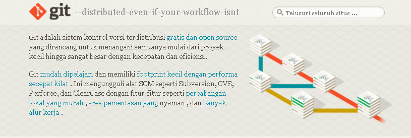
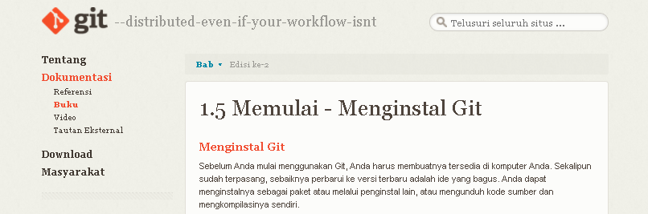
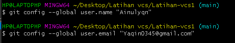

# Latihan-vcs1

**Nama : Ainul Yaqin**

**Kelas : TI.20.A.1**

**NIM : 312010423**

# **LANGKAH-LANGKAH PENGGUNAAN GIT  **

* Download git terlebih dahulu,dengan link 
berikut:[click Here](https://git-scm.com/)

* setelah file terdownload silahkan lakukan instalasi dengan referensi berikut ini : [Git instalation guide](https://git-scm.com/book/en/v2/Getting-Started-Installing-Git)

* setelah installasi selesai,buka GitBash pada menu di windows, dan lakukan pengecekan versi,dengan mengetik syntax berikut :

`git --version`

* jika muncul tampilan git version, berarti Git sudah berhasil di install dan bisadi gunakan Langkah pertama kita mengkonfirmasikan user name dan email di git, dengan mengetikan syntax berikut :

`git commit --global user.name"masukan nama anda"`

`git commit --global user.email "masukin email anda"`

* buat akun di **GitHub**,seperti contoh dibawah ini. Dan lakukan verifikasi akun melalui email yang sudah terdaftar.

* jika akun **GitHub** sudah selesai dibuat dan di verifikasi, proses selanjutnya silahkan buat Repository seperti gambar dibawah ini :

**Penjelasan**