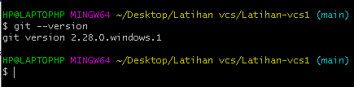

# Latihan-vcs1

**Nama : Ainul Yaqin**

**Kelas : TI.20.A.1**

**NIM : 312010423**

# **LANGKAH-LANGKAH PENGGUNAAN GIT  **

* Download git terlebih dahulu,dengan link 
berikut:[click Here](https://git-scm.com/)

* setelah file terdownload silahkan lakukan instalasi dengan referensi berikut ini : [Git instalation guide](https://git-scm.com/book/en/v2/Getting-Started-Installing-Git)

* setelah installasi selesai,buka GitBash pada menu di windows, dan lakukan pengecekan versi,dengan mengetik syntax berikut :

`git --version`

* jika muncul tampilan git version, berarti Git sudah berhasil di install dan bisadi gunakan Langkah pertama kita mengkonfirmasikan user name dan email di git, dengan mengetikan syntax berikut :

`git commit --global user.name"masukan nama anda"`

`git commit --global user.email "masukin email anda"`

* buat akun di **GitHub**,seperti contoh dibawah ini. Dan lakukan verifikasi akun melalui email yang sudah terdaftar.

* jika akun **GitHub** sudah selesai dibuat dan di verifikasi, proses selanjutnya silahkan buat Repository seperti gambar dibawah ini :

**Penjelasan**

* `Repository Name : (Silahkan isi nama repository yan diinginkan seperti contoh saya ingin membuat repository Latihanvcs3)`

* `Description : (Isi dengan deskripsi atau penjelasan tentang repository Anda)`

* `Public / Private : (Pilih salah satu jenis repository akan bisa dilihan sama semua orang atau tidak)`

* `Add a README.md file : Centang pada bagian ini jika Anda menginginkan file README.md ada di repository Anda`

* `Add .gitignore : Merupakan sebuah file yang berisi daftar nama-nama file dan direktori yang akan diabaikan oleh Git.`

* `Choose a license : Silahkan centang jika Anda memiliki lisensi pada repository yang akan dibuat Kemudian tekan tombol Create Repository untuk menyimpan`

* Jika repository sudah dibuat maka akan muncul tampilan seperti dibawah ini :

* Pembuatan akun dan repository pada Github telah selesai, saat ini akan kita lakukan untuk *me-remote* repository Github pada GitBash Lokal. Bagaimana caranya? Langkah pertama kita harus menyalin link *URL git* kita di Github, dengan cara tekan tombol **Code** lalu klik *Copy*.

* Setelah *Link URL git kita tercopy*, Silahkan buka File Explorer pada Windows, kemudian pilih folder dimana kita akan mendownload Repository dari Github ke lokal. Kemudian Klik Kanan, Pilih **Git Bash Here**.

*Pop Up Command Prompt* **(CMD)** akan terbuka. Pada proses ini kita akan melakukan download file repository yang tadi dibuat, dengan mengetikkan syntax berikut :

git clone [URL](https://github.com/Ainulyqn/Latihan-vcs1.git) pada contohnya, saya akan memasukan git clone

* Setelah proses cloning selesai, pada saat ini kita masih pada folder awal, kita harus masuk kedalam folder yang telah dicloning tadi yaitu LatihanVCS dengan mengetikkan syntax berikut : cd Latihanvcs1/

* Saat ini kita sudah masuk kedalam folder *LatihanVCS*, Silahkan edit file README.md yang ada di File Explorer. Bisa menggunakan Text Editor *(Sublime Text, Notepad, Notepad++, Visual Studio Code)*. Edit sesuai dengan keinginan.

Setelah file README.md diedit, silahkan Simpan file tersebut dengan cara **CTRL+S atau File -> Save**